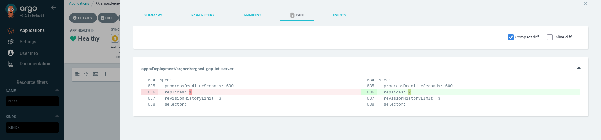
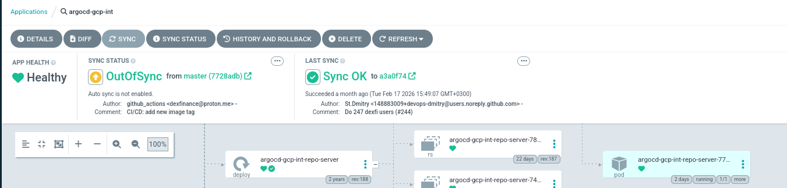
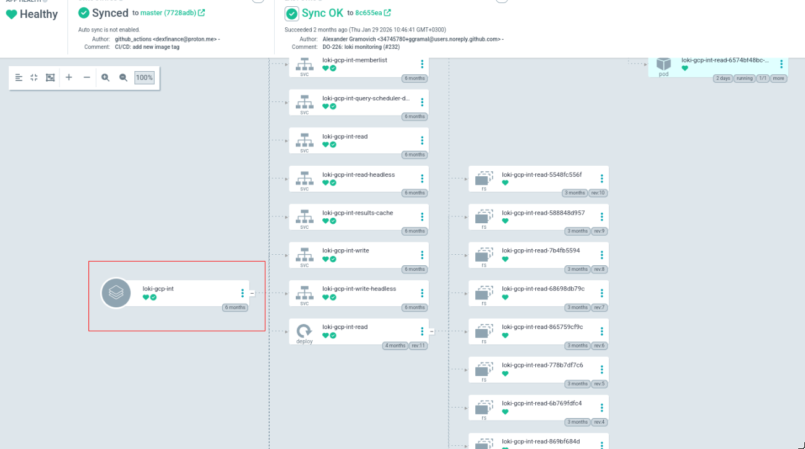
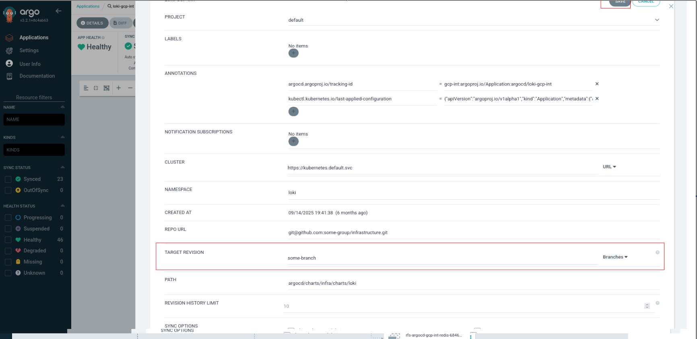
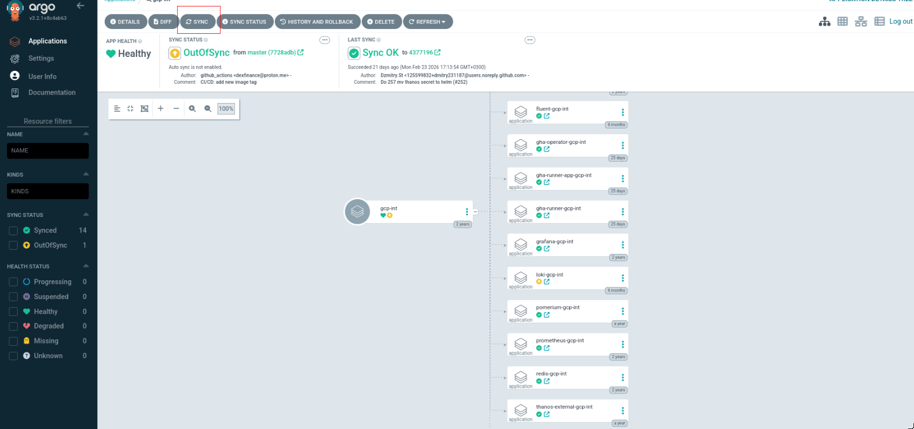

# argocd

All k8s resources are managed by gitops tool - [argocd](https://github.com/argoproj/argo-cd). All commits to files in `argocd/` folder in `master` branch change the sate of k8s resources

## Structure

TBD

## Making changes

If you need to make changes to the application or an infrastructure component you need to

1. Create a new branch
2. Make changes to your app under `argocd/environments/<your env>/<your app>/values.yaml` and commit them
3. Make a PR/MR and head for `master` branch
4. After PR/MR is reviewed and merged head to `argocd` and login - `https://ag.int.<you company domain name>` example `https://ag.int.acme.com`
5. Find your app an review the diff by pressing the `diff` button 

6. Press sync button to synchronize your changes

 

If you make sophisticated changes and you want to test them before merging you need to

1. Create a new branch
2. Make your changes
3. Find your environment and your app and press click on the Application definition

 

4. Edit target revision field and change it to you branch name

5. After tests are finished make a PR/MR and head for `master` branch
6. After PR/MR is reviewed and merged sync the environment your app was in 

