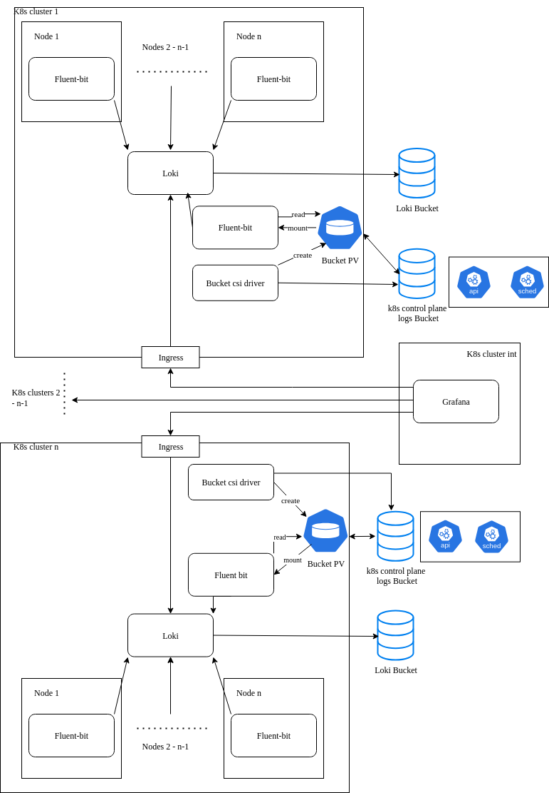

# Logging

Logging is crucial component of any infrastructure. Logging answers this basic questions
* What happened
* When, why and where did it happen
* In some cases, this provides an answer to the question of who did it
* What were the consequences
  
Having such information engineers can tell

* Logs help determine the exact location and cause of errors
* Potential problems can be identified
* Security issues

Logging consists of several components
* log collectors
* log aggregation system
* visualization

# Architecture proposal

## Explanation

This architecture is based on Loki and fluent-bit as a common logging system for kubernetes clusters

Architecture components:
* Fluent-bit - log collector, used for:
    * Pulling and pushing logs
    * Filtering labels
    * Transformation logs to a preset format
* Kafka - message queue to prevent log loss
* Loki used for
    * API for issueing queries (LogQL)
    * Responsible for ingesting and storing logs and processing queries
* Grafana - logs visualization (dashboards)

As any system loki has its pros and cons

Pros:
* Cost-effectiveness: Loki indexes only the metadata of logs, not the logs themselves
* Integration: Integrates seamlessly with Kubernetes, Prometheus, and Grafana
* Scalability: It can be scaled for both small and large-scale operations
* Reliability: Ensures quorum consistency for read and write operations, and has replication to protect against failures
* Ease of use: Allows you to store logs in various object storages or a file system 

Cons:
* Limited querying capabilities: Because Loki doesn't index the full log content, complex queries based on log content (e.g., searching for specific keywords within the logs) can be more challenging and may require more time to execute  
* Dependency on Grafana: While the integration with Grafana is a benefit for many users, it can also be a drawback for those who don't already use Grafana or prefer other visualization tools 
* Less advanced features: Compared to more mature systems like the ELK stack, Loki may lack some advanced features like built-in data enrichment or complex data processing pipelines

## Fluent-bit

We use a node logging agent fluent-bit on each node (DaemonSet).
Using `Fluent-bit` we can
* pulling pods(containers) logs (from stdout/stderr)
* pulling node logs
* pulling logs from kubernetes (events, api, scheduler, kubelet, proxy, etc.)
* changing structure of logs to a common view
* label filtering to use a common set of labels (loki indexes log labels to speed up the search, so there shouldn't be a lot of labels to reduce the load on loki):
  * env
  * node
  * namespace
  * app_kubernetes_io_instance
  * pod
  * container
  * stream
  * log_level
  * project

We can use fluent-bit as a sidecar in cases where it is necessary to read log files inside the container, and there is no way to send data to stdout, but the operator does not provide such an opportunity.

## Loki

## TO DO
* add the ability to view kubernetes logs in grafana
* pulling logs from GCP/YCP/AWS/etc
* research the possibility of sending container logs to stdout using the plugin <a href="https://docs.fluentbit.io/manual/pipeline/inputs/exec">exec</a> (opportunity, security, stability - ?), or try <a href="https://github.com/h3poteto/fluentd-sidecar-injector">sidecar-injector</a>, or anything else

