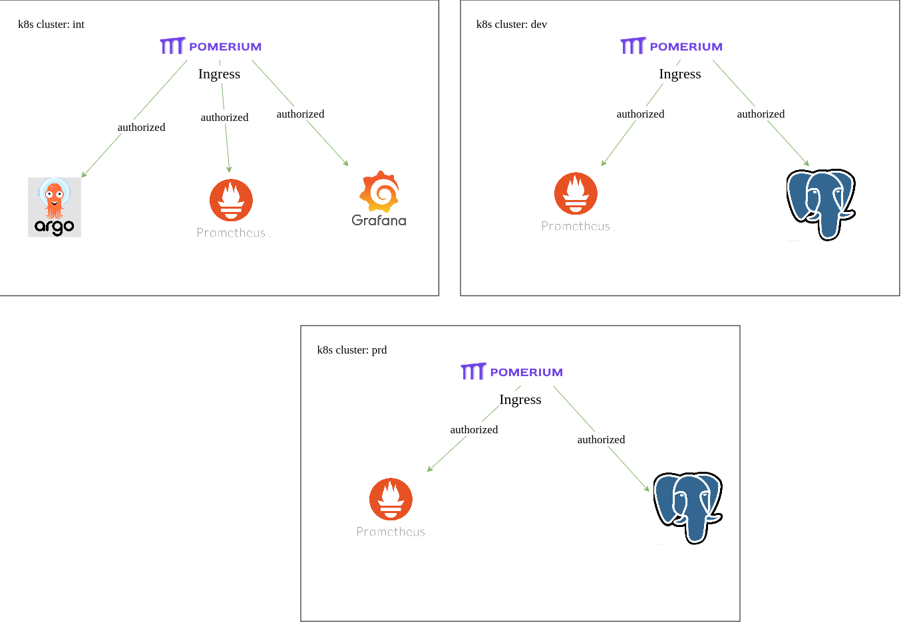

# Authentication and authorization

As a single point of authentication and authorization for infrastructure services like (grafana, argocd, prometheus etc) we use identity aware proxy - [pomerium](https://www.pomerium.com/docs) 

Pomerium sits between end users and services requiring strong authentication. After verifying identity with an identity provider (IdP), Pomerium uses a configurable policy to decide how to route your user's request and if they are authorized to access the service

## Architecture


1. User tries to access `https://argocd.int.example.com`
2. Pomerium ingress checks if there is a session for the user. Sessions can be stored in memory or postgresql
3. if there is no session it redirects the user to go through a identity provider (for example Github) authentication flow
4. After authentication flow pomerium recieves claims (attributes like email etc) from idp
5. Based on recieved claims and authorization annotation of each ingress pomerium makes the decission to pass certain user to the app


## Authorization annotation

Authorization to an ingress endpoint is configured via `ingress.pomerium.io/policy`. For example by setting annotation to

```
ingress.pomerium.io/policy: |
  allow:
    or:
      - user:
          is: user1@example.com
      - user:
          is: user2@example.com
```

we will allow user1@example.com, user2@example.com to access an ingress resource.

```
ingress.pomerium.io/policy: |
  allow:
    and:
      - domain:
          is: example.com
```

this policy allows anyone with email from `example.com` access ingress resource


## Multi  clusters 

For multiple kubernetes clusters each cluster will have its own pomerium ingress



