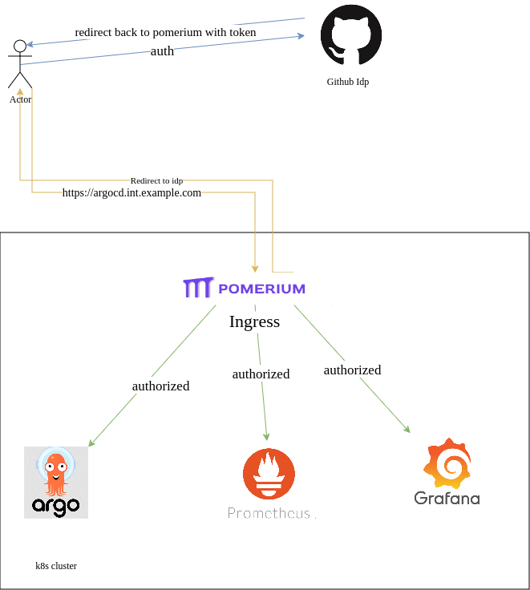

# Authentication and authorization

As a single point of authentication and authorization for infrastructure services like (grafana, argocd, prometheus etc) we use identity aware proxy - [pomerium](https://www.pomerium.com/docs)

Pomerium sits between end users and services requiring strong authentication. After verifying identity with your identity provider (IdP), Pomerium uses a configurable policy to decide how to route your user's request and if they are authorized to access the service

## Architecture

